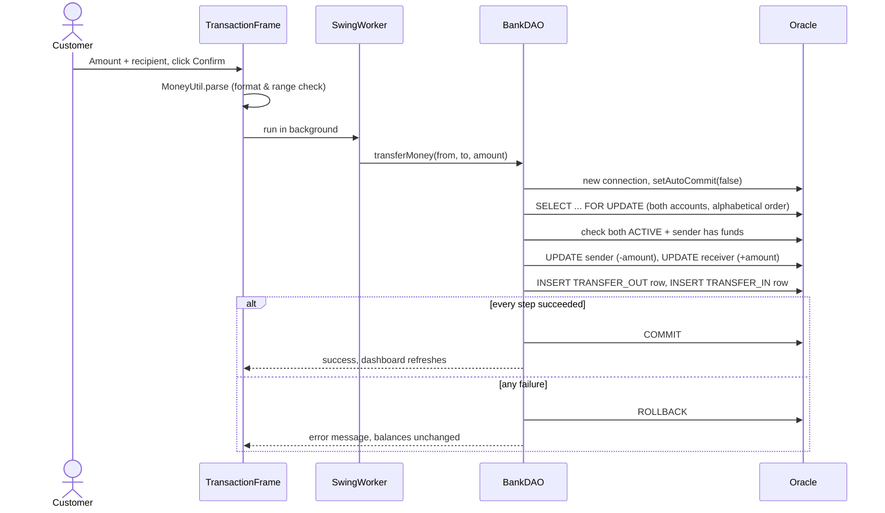
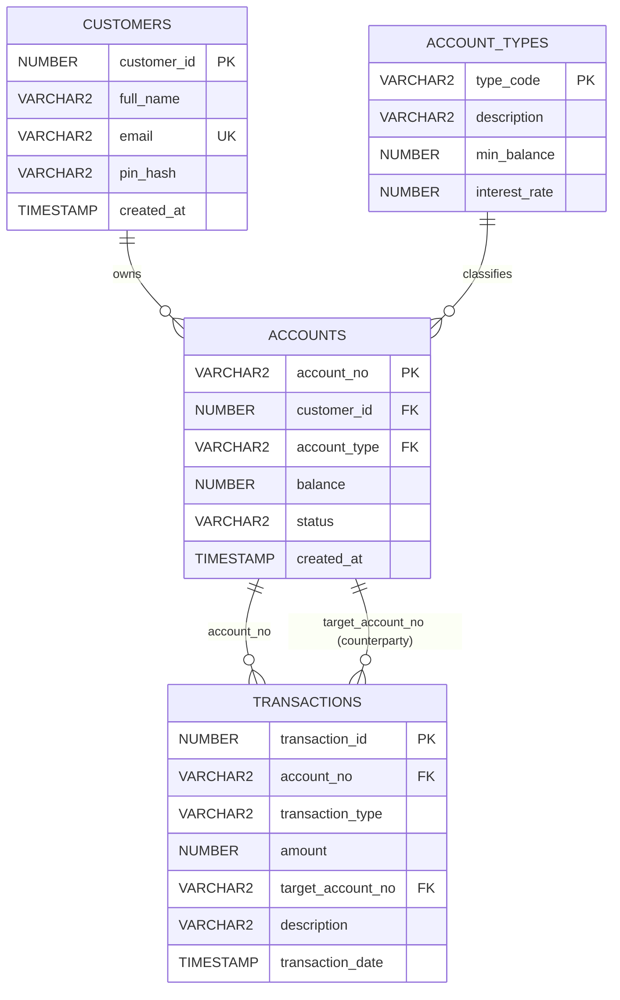

# MINI BANKING SYSTEM: SECURE DEPOSITS, WITHDRAWALS & TRANSFERS

> **Team Name:** _<your team name>_
> **Course / Event:** _<course name, mini project>_
> **Problem Statement ID:** 12
> **Problem Statement:** Mini Banking System with Java Swing/AWT, JDBC and Oracle Database
> **Domain:** Database Systems & Desktop Application Development
> **Current Status:** 🟢 **Core Implementation Complete | Security Hardening Applied | Oracle Integration Verification In Progress**

---

## 📌 Executive Summary

> **Problem Statement:** Design a mini banking system where customers can **deposit, withdraw, and transfer money** between accounts through a **Java Swing/AWT interface**. **JDBC** manages account and transaction records, while **Oracle Database** ensures transaction safety and consistency. **Prerequisite:** perform database normalization as necessary and justify it.

Our project is a **desktop banking application** that lets a customer log in, view a live balance, and perform three operations: **deposit**, **withdraw** and **transfer**. Every operation is executed as a single **ACID database transaction** through JDBC, so money can never be half-moved: either every step succeeds and is committed, or everything is rolled back.

The system is built on three ideas:

- **Layered design:** Swing UI → DAO (all SQL and transactions) → Oracle. There is no SQL inside UI code.
- **Safety first:** row-level locking, deadlock-free lock ordering, `BigDecimal` money arithmetic, salted PIN hashes, and database `CHECK` constraints that enforce the rules even if application code has a bug.
- **A properly normalized schema:** four tables in **3NF** (customers, account types, accounts, transactions), justified step by step in [Section 4](#-4-database-design--normalization).

> **Core System Principle:**
> **"The database is the final line of defence."** Business rules are checked in Java *and* enforced again by Oracle constraints (`balance >= 0`, `amount > 0`, foreign keys, status/type checks).

---

### 📊 Implementation Progress & Deliverables Matrix

| Subsystem / Module | Scope & Technology | Status | Key Deliverables |
| :-- | :-- | :--: | :-- |
| **Swing/AWT User Interface** | `src/ui`, Swing (Nimbus L&F) | 🟢 **Complete** | Login screen with in-app DB settings dialog, dashboard (balance card, action buttons, activity table), transaction dialog (deposit / withdraw / transfer). All DB calls run in `SwingWorker` threads. |
| **JDBC Data Access Layer** | `src/dao/BankDAO.java` | 🟢 **Complete** | Authenticate, deposit, withdraw, transfer, recent-activity query. `PreparedStatement` everywhere. One fresh connection per operation. |
| **ACID Transaction Handling** | `setAutoCommit(false)`, `commit`, `rollback`, `FOR UPDATE` | 🟢 **Complete** | Atomic transfers, row locks on the account rows only, deterministic lock order (no deadlocks), rollback on any failure. |
| **Connection & Configuration** | `src/config/DatabaseConnection.java` | 🟢 **Complete** | Credentials read from `config.properties` / env vars / JVM flags; nothing hard-coded; never committed to Git. |
| **Oracle Database Schema** | `db/schema.sql` | 🟢 **Complete** | 4 tables in 3NF, 2 sequences, 3 indexes, `CHECK` + foreign-key constraints, seed data. Re-runnable script. |
| **Normalization Justification** | Section 4 of this README | 🟢 **Complete** | Unnormalized table → 1NF → 2NF → 3NF with anomalies and fixes. |
| **Security Hardening** | `util/PinUtil`, `util/MoneyUtil` | 🟢 **Complete** | Salted SHA-256 PIN hashes, `BigDecimal` money validation (max 2 decimals, range checks), frozen/closed account checks. |
| **Developer Experience (VS Code)** | `.vscode/`, `scripts/` | 🟢 **Complete** | One-click Run/Debug, build tasks, recommended extensions, build/run/test scripts for Windows and Linux/macOS. |
| **Automated Smoke Tests** | `test/SmokeTests.java` | 🟢 **19 / 19 passing** | PIN hashing and money validation, no database required. |
| **Oracle Integration Verification** | Manual checklist, [Section 8](#-8-verification--testing) | 🟡 **In progress** | Run the checklist against your Oracle XE instance and tick the boxes. |
| **Account Creation / Admin Screens** | – | 🔵 **Planned** | See [Roadmap](#-11-roadmap). |

---

# 🎯 1. Problem Statement Alignment

| Requirement from the problem statement | Our implementation | Where to look | Status |
| :-- | :-- | :-- | :--: |
| Customers can **deposit** money | `BankDAO.deposit()`: lock row → add amount → log transaction → commit | `src/dao/BankDAO.java` | 🟢 |
| Customers can **withdraw** money | `BankDAO.withdraw()`: lock row → check funds → subtract → log → commit | `src/dao/BankDAO.java` | 🟢 |
| Customers can **transfer** between accounts | `BankDAO.transferMoney()`: lock both rows in order → checks → debit + credit + 2 log rows → commit | `src/dao/BankDAO.java` | 🟢 |
| **Java Swing/AWT interface** | Login, dashboard, transaction dialog | `src/ui/` | 🟢 |
| **JDBC** manages account & transaction records | DAO layer, `PreparedStatement`, `Connection` per operation | `src/dao/`, `src/config/` | 🟢 |
| **Oracle Database** ensures safety & consistency | Row locks, constraints, sequences, transactions | `db/schema.sql` | 🟢 |
| **Normalization** with justification | 3NF schema, justified in Section 4 | `db/schema.sql`, README | 🟢 |

---

# 🏗️ 2. System Architecture

```text
┌──────────────────────────────────────────────────────────────┐
│  VIEW  (Swing / AWT)                  src/ui                  │
│  LoginFrame · DashboardFrame · TransactionFrame               │
│  Reads input, validates format, shows results.  NO SQL.       │
└──────────────────────────┬───────────────────────────────────┘
                           │  SwingWorker (background thread)
                           ▼
┌──────────────────────────────────────────────────────────────┐
│  DAO  (JDBC)                          src/dao                 │
│  BankDAO: authenticate · deposit · withdraw · transferMoney   │
│  All SQL + transaction control. Throws BankException for      │
│  business-rule failures (e.g. insufficient funds).            │
└───────────┬───────────────────────────────────┬──────────────┘
            │ uses                              │ uses
            ▼                                   ▼
┌───────────────────────────┐     ┌──────────────────────────────┐
│ config.DatabaseConnection │     │ util.PinUtil · util.MoneyUtil │
│ New Oracle connection per │     │ Salted PIN hashing,           │
│ operation; settings from  │     │ BigDecimal amount validation  │
│ config.properties         │     └──────────────────────────────┘
└─────────────┬─────────────┘
              │ JDBC (ojdbc)
              ▼
┌──────────────────────────────────────────────────────────────┐
│  ORACLE DATABASE                      db/schema.sql           │
│  CUSTOMERS · ACCOUNT_TYPES · ACCOUNTS · TRANSACTIONS          │
│  Constraints, sequences, indexes: the final safety net        │
└──────────────────────────────────────────────────────────────┘
        model.Account · model.Transaction travel between layers
```

### Layer responsibilities

| Layer | Responsibility | Rule we follow |
| :-- | :-- | :-- |
| **View** (`ui`) | Draw screens, collect input, show results | No SQL in UI classes |
| **DAO** (`dao`) | Every SQL statement and every commit/rollback | One public method = one business operation |
| **Config** (`config`) | Open Oracle connections | Credentials come from outside the code |
| **Util** (`util`) | PIN hashing, money validation | Pure functions, unit-testable without a DB |
| **Model** (`model`) | Plain data objects | No UI or SQL logic |
| **Database** | Final integrity enforcement | Rules hold even if Java code is wrong |

### Transfer sequence



---

# 🖥️ 3. User Interface

| Login | Dashboard |
| :--: | :--: |
|  |  |

| Transaction dialog (Deposit / Withdraw / Transfer) |
| :--: |
|  |

> Screenshots were rendered from the real Swing classes; the dashboard row is the seed deposit for `ACC1001`. Replace them with captures from your own machine at any time (same file names).

### Screens

- **Login:** account number + PIN. The *Oracle DB Settings* link opens a dialog to change URL / user / password and tests the connection immediately.
- **Dashboard:** welcome banner, available balance, **Deposit / Withdraw / Transfer** buttons, *Recent Account Activity* table (ID, date, type, amount, counterparty, description). Amounts are coloured green for money in (`DEPOSIT`, `TRANSFER_IN`) and red for money out (`WITHDRAWAL`, `TRANSFER_OUT`).
- **Transaction dialog:** choose type, enter amount (and recipient for transfers). Invalid input is rejected before touching the database.

---

# 🗄️ 4. Database Design & Normalization

## 4.1 Entity-Relationship Diagram



## 4.2 Tables & Constraints

| Table | Purpose | Key constraints |
| :-- | :-- | :-- |
| `CUSTOMERS` | Who the customer is | PK `customer_id`; `email` UNIQUE; credentials stored as `salt$sha256` |
| `ACCOUNT_TYPES` | Facts about an account *type* (min balance, interest) | PK `type_code`; `CHECK (min_balance >= 0)`, `CHECK (interest_rate >= 0)` |
| `ACCOUNTS` | Money held by a customer | PK `account_no`; FK → `CUSTOMERS`; FK → `ACCOUNT_TYPES`; `CHECK (balance >= 0)`; `CHECK (status IN ('ACTIVE','FROZEN','CLOSED'))` |
| `TRANSACTIONS` | Immutable audit log | PK `transaction_id`; FK → `ACCOUNTS` (twice); `CHECK (amount > 0)`; `CHECK (transaction_type IN ('DEPOSIT','WITHDRAWAL','TRANSFER_OUT','TRANSFER_IN'))` |

Sequences `SEQ_CUSTOMER_ID` and `SEQ_TRANSACTION_ID` generate IDs. Indexes cover `accounts(customer_id)`, `transactions(account_no, transaction_date DESC)` and `transactions(target_account_no)`.

## 4.3 Normalization (1NF → 2NF → 3NF)

### Step 0: Unnormalized design (one big table)

| AccountNo | CustName | Email | PIN | AccType | MinBal | Interest | Balance | TxnType | Amount | TxnDate | Counterparty |
| :-- | :-- | :-- | :-- | :-- | :-: | :-: | :-: | :-- | :-: | :-- | :-- |
| ACC1001 | Alex Morgan | alex@… | … | SAVINGS | 500 | 3.5 | 2300 | DEPOSIT | 2500 | 01-Jan | – |
| ACC1001 | Alex Morgan | alex@… | … | SAVINGS | 500 | 3.5 | 2300 | TRANSFER_OUT | 200 | 05-Jan | ACC1002 |

**Anomalies:** customer and account-type data repeat on every transaction row (**redundancy**). Changing an e-mail means editing many rows (**update anomaly**). A new account with no transactions cannot be stored cleanly (**insert anomaly**). Deleting an account's only transaction can erase the customer's details (**delete anomaly**).

### 1NF: atomic values, unique rows
Every column holds a single value, there are no repeating groups, and every row is identified by a key (`transaction_id` for log entries).

### 2NF: no partial dependencies
In the flat table the key is *(account, transaction)*. But customer name, e-mail, PIN, balance and status depend only on the **account**, not on the individual transaction. **Fix:** split account-level data (`ACCOUNTS`) from transaction-level data (`TRANSACTIONS`).

### 3NF: no transitive dependencies
- `account_no → customer_id → full_name, email, pin_hash` is transitive. **Fix:** move customer attributes to `CUSTOMERS`; `ACCOUNTS` keeps only the `customer_id` foreign key.
- `account_no → account_type → min_balance, interest_rate` is transitive. **Fix:** move type attributes to `ACCOUNT_TYPES`; `ACCOUNTS` keeps only the `account_type` foreign key.

### Result

| Benefit | Explanation |
| :-- | :-- |
| No redundancy | Each fact is stored exactly once |
| No update anomaly | Change an e-mail or interest rate in one row |
| No insert / delete anomaly | Customers, types and accounts exist independently |
| Integrity | Foreign keys make orphan records impossible |

> **Deliberate design choice:** the current balance is stored on `ACCOUNTS` even though it could be derived by summing `TRANSACTIONS`. This is a controlled, standard banking trade-off (fast reads; the value is updated only inside the same transaction that writes the log row, under a row lock) and not a normalization violation of the schema's keys.

---

# 🔐 5. Transaction Safety (ACID)

| Property | Meaning | How we guarantee it |
| :-- | :-- | :-- |
| **A**tomicity | All steps happen or none do | `setAutoCommit(false)`; `commit()` at the end; `rollback()` in the `catch` for any `SQLException` / `RuntimeException` |
| **C**onsistency | Data always obeys the rules | `CHECK (balance >= 0)`, `CHECK (amount > 0)`, foreign keys, status checks in Java and in SQL |
| **I**solation | Concurrent operations do not corrupt each other | One connection per operation + `SELECT ... FOR UPDATE OF a.balance` row locks held until commit |
| **D**urability | Committed data survives crashes | Oracle redo logging once `COMMIT` returns |

### Deadlock prevention
If A→B and B→A transfers run simultaneously, locking in opposite order would deadlock. `transferMoney` **always locks the alphabetically smaller account number first**, so both transfers request locks in the same order.

### Defence-in-depth

| Threat | Defence |
| :-- | :-- |
| SQL injection | `PreparedStatement` with bound parameters everywhere |
| Floating-point money errors | `BigDecimal` end-to-end; max 2 decimal places; range-checked (`MoneyUtil`) |
| Negative / zero amounts | Rejected in the UI, in `MoneyUtil`, and by `CHECK (amount > 0)` |
| Overdraft | Balance checked under lock **and** `CHECK (balance >= 0)` |
| Self-transfer | Explicitly rejected |
| Frozen / closed accounts | Sender, receiver and depositor must be `ACTIVE` |
| Plain-text PINs | Stored as `salt$SHA-256(salt + pin)` (`PinUtil`), compared in constant time |
| Credentials in Git | Read from untracked `config.properties`; `.gitignore` blocks it |
| Frozen UI | DB calls run in `SwingWorker`, never on the UI thread |

---

# 📂 6. Repository Layout

```text
swing-jdbc-bank-app/
├── README.md                       <-- Project documentation (this file)
├── .gitignore                      <-- Ignores bin/, config.properties, driver jars
├── config.properties.example       <-- Template: copy to config.properties and fill in
│
├── .vscode/                        <-- One-click VS Code setup
│   ├── settings.json               <-- Source/output/library paths for the Java extension
│   ├── launch.json                 <-- ▶ Run Mini Banking System / Run Smoke Tests
│   ├── tasks.json                  <-- Build / Run / Test tasks
│   └── extensions.json             <-- Recommended extensions
│
├── db/
│   ├── 00_create_user.sql          <-- Optional: dedicated BANKAPP schema user
│   └── schema.sql                  <-- Tables, constraints, sequences, indexes, seed data
│
├── lib/                            <-- Put ojdbc11.jar here (git-ignored, see lib/README.md)
│
├── scripts/                        <-- build / run / test for Windows (.bat) and Linux/macOS (.sh)
│
├── src/
│   ├── Main.java                   <-- Entry point (Nimbus look & feel, opens LoginFrame)
│   ├── config/DatabaseConnection.java   <-- Reads settings, opens a new Oracle connection
│   ├── model/                      <-- Account.java, Transaction.java
│   ├── dao/                        <-- BankDAO.java, BankException.java
│   ├── util/                       <-- PinUtil.java, MoneyUtil.java
│   └── ui/                         <-- LoginFrame, DashboardFrame, TransactionFrame
│
├── test/SmokeTests.java            <-- Database-free tests (PIN hashing, money validation)
└── docs/screenshots/               <-- login.png, dashboard.png, transfer.png
```

---

# 🚀 7. Quickstart & Execution Guide

### Prerequisites

| Requirement | Version | Notes |
| :-- | :-- | :-- |
| JDK | 11 or newer (17 / 21 recommended) | Check with `java -version` and `javac -version` |
| Oracle Database | XE 21c (or 18c / 19c) | Free. Remember the `SYSTEM` password you set |
| Oracle SQL Developer | any | To run the SQL scripts |
| Oracle JDBC driver | `ojdbc11.jar` (or `ojdbc8.jar`) | Place in `lib/` |
| VS Code + **Extension Pack for Java** | latest | Recommended; prompts appear automatically |

### 1. Clone and get the driver

```bash
git clone https://github.com/Sanjay4807/swing-jdbc-bank-app.git
cd swing-jdbc-bank-app
```
Download `ojdbc11.jar` and drop it into `lib/`.

### 2. Create the database objects

1. In SQL Developer connect as `SYSTEM` (host `localhost`, port `1521`, **service name `XEPDB1`**).
2. *(Recommended)* run `db/00_create_user.sql` to create the `BANKAPP` user.
3. Connect as `BANKAPP` (or whichever user you chose) and run `db/schema.sql` as a script (F5).

### 3. Configure credentials (never committed)

```bash
cp config.properties.example config.properties      # Windows: copy config.properties.example config.properties
```
Edit `config.properties`:
```properties
db.url=jdbc:oracle:thin:@//localhost:1521/XEPDB1
db.user=bankapp
db.password=your_password_here
```

### 4A. Run from VS Code (easiest)

1. **File → Open Folder…** and choose the repo folder. Accept the *Recommended extensions* prompt.
2. Open `src/Main.java` and click **▶ Run** above `main`, or press **F5** and pick **Run Mini Banking System**.
3. Terminal → *Run Build Task* (`Ctrl+Shift+B`) compiles to `bin/` using the scripts.

### 4B. Run from the command line

| | Windows | Linux / macOS |
| :-- | :-- | :-- |
| Build | `scripts\build.bat` | `./scripts/build.sh` |
| Run | `scripts\run.bat` | `./scripts/run.sh` |
| Smoke tests | `scripts\test.bat` | `./scripts/test.sh` |

### 5. Log in

| Account No | PIN | Starting balance | Type |
| :-- | :-- | :-: | :-- |
| `ACC1001` | `1234` | 2,500.00 | Savings |
| `ACC1002` | `5678` | 1,200.00 | Checking |
| `ACC1003` | `9999` | 5,000.00 | Savings |

Try a transfer from `ACC1001` to `ACC1002` and watch both balances and the activity table update. To create a hash for a new PIN: `java -cp bin util.PinUtil 4321`.

### Troubleshooting

| Symptom | Likely cause | Fix |
| :-- | :-- | :-- |
| *"Oracle JDBC driver not found"* | Jar missing | Put `ojdbc11.jar` in `lib/` (reload the VS Code window) |
| *"No database user configured"* | No `config.properties` | Copy the example file and fill it in, or use **Oracle DB Settings** on the login screen |
| `ORA-12541` / connection refused | Listener / service not running | Start `OracleServiceXE` and `OracleXETNSListener` (`services.msc` on Windows) |
| `ORA-12505` / unknown SID | Wrong URL style | Use `jdbc:oracle:thin:@//localhost:1521/XEPDB1` (service name), or `…@localhost:1521:xe` for old SID setups |
| `ORA-01017` invalid username/password | Wrong credentials | Fix `config.properties` or the settings dialog |
| `ORA-00942` table or view does not exist | `schema.sql` run as a different user | Run it as the same user the app connects with |
| `ORA-01950` no privileges on tablespace | New user has no quota | `ALTER USER bankapp QUOTA UNLIMITED ON USERS;` |
| Login says invalid PIN for seed accounts | Old plain-text seed data still in DB | Re-run `db/schema.sql` (it drops and recreates everything) |
| VS Code shows red errors on `import util...` | Java project not refreshed | Command Palette → *Java: Clean Java Language Server Workspace* |

---

# 🧪 8. Verification & Testing

### 8.1 Automated smoke tests (no database needed): ✅ 19 / 19 passing

`scripts/test.sh` or `scripts\test.bat` runs `test/SmokeTests.java`:

- PIN hash verifies; wrong PIN rejected; same PIN gets different salts; malformed / null input rejected
- The three seed hashes in `db/schema.sql` match PINs `1234`, `5678`, `9999`
- Money parsing: accepts `100`, `99.5`, `5.10`; rejects `0`, negatives, 3 decimals, oversized values, blank and non-numeric text

### 8.2 Manual Oracle integration checklist (tick as you test)

**Happy path**
- [ ] Log in as `ACC1001` / `1234`; dashboard shows $2,500.00
- [ ] Deposit 500 → balance $3,000.00, `DEPOSIT` row appears
- [ ] Withdraw 200 → balance $2,800.00, `WITHDRAWAL` row appears
- [ ] Transfer 300 to `ACC1002` → sender $2,500.00; log in as `ACC1002` and see $1,500.00 and a `TRANSFER_IN` row

**Safety / failure paths (nothing may change in the database)**
- [ ] Withdraw more than the balance → *Insufficient funds*, balance unchanged
- [ ] Transfer to a non-existent account → error, sender balance unchanged
- [ ] Transfer to your own account → rejected
- [ ] Amount `0`, `-5`, `1.234`, `abc` → rejected before reaching the database
- [ ] Wrong PIN → *Invalid Account Number or PIN*
- [ ] `UPDATE ACCOUNTS SET status='FROZEN' WHERE account_no='ACC1002'` then transfer to it → rejected

**Atomicity proof (great for the viva)**
- [ ] Temporarily make the second log `INSERT` in `transferMoney` fail (e.g. misspell the table), run a transfer, and confirm **neither balance changed** (the debit was rolled back)

**Concurrency**
- [ ] Run two app instances and transfer `ACC1001→ACC1002` and `ACC1002→ACC1001` at the same time; both complete, no deadlock, totals are conserved

### 8.3 SQL queries for demonstrating consistency

```sql
-- Total money in the bank must never change after transfers
SELECT SUM(balance) FROM ACCOUNTS;

-- Every transfer produces a matching OUT/IN pair
SELECT transaction_type, COUNT(*), SUM(amount) FROM TRANSACTIONS
WHERE transaction_type LIKE 'TRANSFER%' GROUP BY transaction_type;

-- Account activity
SELECT * FROM TRANSACTIONS WHERE account_no = 'ACC1001' ORDER BY transaction_date DESC;
```

---

# 🔄 9. Team Git Workflow (VS Code)

```bash
git pull origin main                      # always start here
git checkout -b feature/short-name        # one branch per task
# ... edit in VS Code ...
git add .
git commit -m "Add: withdraw validation"
git push origin feature/short-name        # then open a Pull Request on GitHub
```

In VS Code you can do the same from the **Source Control** panel (`Ctrl+Shift+G`): stage → write message → **Commit** → **Sync Changes**.

**Rules of the road**

- ❌ Never commit `config.properties`, passwords, or `.jar` files (the `.gitignore` already blocks them; do not override it)
- ❌ Never put SQL in `ui/` classes; SQL belongs in `dao/`
- ✅ Use `PreparedStatement` for every query and `BigDecimal` for every amount
- ✅ Run `scripts/test.*` before every push
- ✅ One teammate reviews each Pull Request before merging to `main`
- ✅ Tick roadmap / checklist boxes in this README when you finish an item

### Team

| Name | Role | Responsibility |
| :-- | :-- | :-- |
| _Name 1_ | Team Lead / Backend | DAO, transactions, integration |
| _Name 2_ | Database | Schema, normalization, SQL scripts |
| _Name 3_ | Frontend | Swing screens and UX |
| _Name 4_ | QA & Documentation | Testing, report, screenshots |

---

# ⚠️ 10. Known Limitations (Academic Scope)

- PINs use salted SHA-256, an improvement over plain text but **not** a slow password hash. A production system would use BCrypt / Argon2, rate limiting and account lockout. 4-digit PINs are inherently guessable.
- One new JDBC connection is opened per operation (no connection pool): perfectly fine for this scale, not for thousands of users.
- Accounts and customers are created through SQL only; there is no sign-up or admin screen yet.
- Single currency, displayed as `$`.
- No JUnit-level integration tests against Oracle yet (the manual checklist covers this).

---

# 🗺️ 11. Roadmap

### ✅ Delivered
- [x] Problem analysis, ER design, 3NF normalization with justification
- [x] Oracle schema with constraints, sequences, indexes, `ACCOUNT_TYPES` lookup, seed data
- [x] JDBC DAO with deposit / withdraw / transfer under ACID transactions
- [x] Deterministic lock ordering (deadlock avoidance) and `FOR UPDATE` row locking
- [x] Swing UI: login, dashboard, transaction dialog; `SwingWorker` threading
- [x] Credentials moved out of source code (`config.properties`)
- [x] Salted PIN hashing; `BigDecimal` money handling; frozen/closed account checks
- [x] One connection per operation (true transaction isolation)
- [x] `TRANSFER_IN` / `TRANSFER_OUT` log entries (no duplicate history rows)
- [x] VS Code project setup, run/build/test scripts, smoke tests

### 🔧 Next up
- [ ] Complete and tick the Oracle integration checklist (Section 8.2)
- [ ] Add your team names and course details at the top of this README
- [ ] Final project report (ER diagram image, normalization, screenshots from your machine)

### 🌟 Stretch goals
- [ ] Account-creation and admin screens
- [ ] Full transaction history with date filters and export to PDF/CSV
- [ ] Daily transfer limits and account minimum-balance enforcement using `ACCOUNT_TYPES.min_balance`
- [ ] Transfer logic as an Oracle PL/SQL stored procedure
- [ ] JUnit integration tests with a test schema
- [ ] Migrate to Maven/Gradle with a connection pool (HikariCP)

---

## 🟢 Status Summary

- **Core banking operations (deposit / withdraw / transfer):** 🟢 Implemented
- **ACID guarantees, locking and rollback:** 🟢 Implemented
- **3NF Oracle schema and normalization write-up:** 🟢 Complete
- **Swing/AWT interface:** 🟢 Complete
- **Security hardening (hashed PINs, no hard-coded credentials, BigDecimal):** 🟢 Complete
- **Automated smoke tests:** 🟢 19 / 19 passing
- **Oracle end-to-end verification on team machines:** 🟡 In progress (checklist in Section 8.2)

---

*Mini Banking System: Java Swing/AWT · JDBC · Oracle Database*
